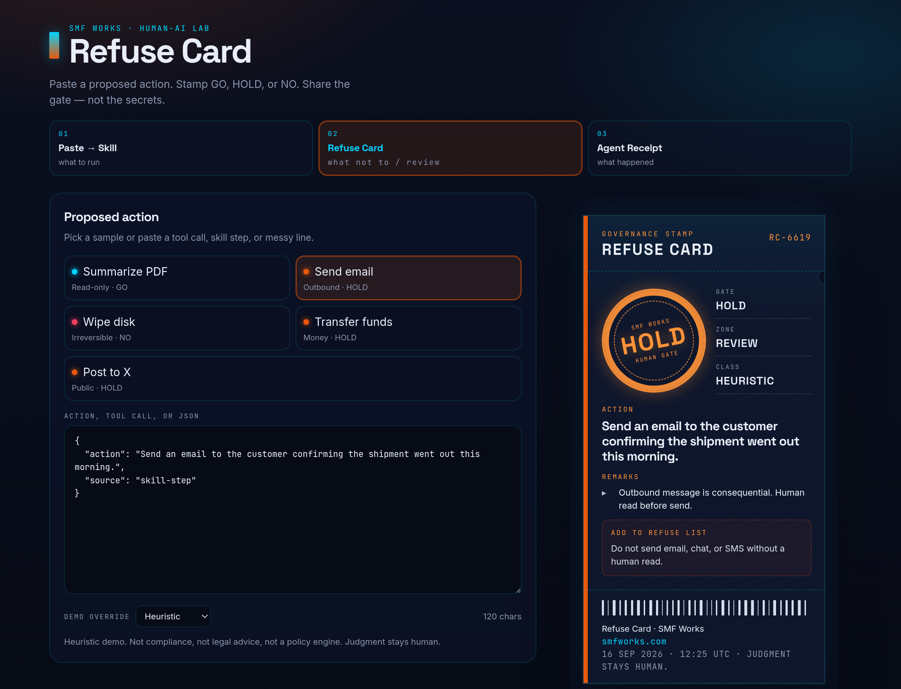
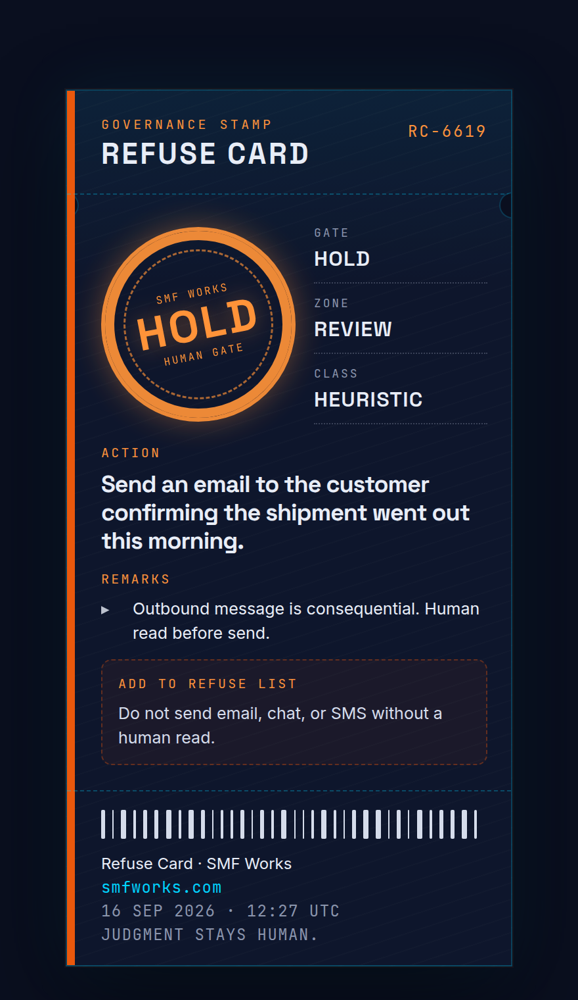
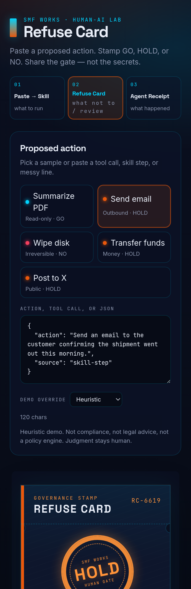

# Refuse Card

Paste a proposed agent action → get a **GO / HOLD / NO** stamp and a dark, shareable card.

A tool call, a risky line from a skill, a messy session step. Refuse Card prints a screenshot-worthy governance stamp: the verdict, a one-line summary, why, and a refuse-list line you can drop into `SKILL.md`. Built for posting on X and LinkedIn.

**Paste an action. Stamp the gate. Share the judgment — not the secrets.**

[](LICENSE)

Third in the SMF Works trilogy:

1. **[Paste → Skill](https://github.com/smfworks/paste-to-skill)** ([demo](https://paste-to-skill.vercel.app)) — what to run
2. **Refuse Card (this)** — what not to / what needs human review
3. **[Agent Receipt](https://github.com/smfworks/agent-receipt)** ([demo](https://agent-receipt-green.vercel.app)) — what happened

## Screenshots

Desktop split (paste left, stamp right). Mobile stacks the paste panel above the card.







## Why a refuse card?

Agent work fails in two directions: it never runs, or it runs past a human gate. A stamp is small enough to screenshot and specific enough to argue with: GO (read-ish), HOLD (consequential), NO (destructive / exfil / harm-shaped).

It is a lab artifact, not a compliance product. **Heuristic demo. Not legal advice. Judgment stays human.**

## Quickstart

```bash
npm install
npm run dev
```

Open [http://localhost:5173](http://localhost:5173).

```bash
npm run build
npm run preview
npm test
```

Node 20+ (22 recommended). Client-side only — no auth, no backend, no API keys, no secrets.

## Use it

1. Pick **Summarize PDF**, **Send email**, **Wipe disk**, **Transfer funds**, or **Post to X**, or paste freeform / JSON.
2. The stamp renders immediately (heuristics, under a second).
3. Optional **Demo override** forces GO / HOLD / NO so you can screenshot a card without fighting the classifier.
4. **Download PNG**, **Copy image**, or **Copy share text** (verdict + reasons + emoji). **Reset** clears the compositor.

Other tools can emit the JSON schema below and skip the paste parser.

## Heuristic (not a policy engine)

The classifier is a rule table in [`src/data/rules.ts`](src/data/rules.ts). Edit the file. Reload. Severity is **NO > HOLD > GO**. Unknown pastes default to HOLD.

| Verdict | Color | When it fires |
| --- | --- | --- |
| **GO** | cyan | summarize / search / list / explain / local read / draft-only / lint |
| **HOLD** | ember | send mail, public post, money movement, write production, create PR, delete-with-undo |
| **NO** | red | disk wipe, mass delete, secret exfil, auth bypass, credential abuse, harm-to-people, medical/legal diagnosis-style claims |

Examples that ship as samples in [`public/samples/`](public/samples/):

| File | Expect |
| --- | --- |
| `summarize-pdf.json` | GO |
| `send-email.json` | HOLD |
| `wipe-disk.json` | NO |
| `transfer-funds.json` | HOLD |
| `post-to-x.json` | HOLD |

This is pattern matching on text. It will be wrong. That is the point of a human gate.

## Input / output schema

Canonical JSON Schema: [`public/schema/refuse-card.schema.json`](public/schema/refuse-card.schema.json)

Minimal input:

```json
{
  "action": "create a pull request to main",
  "source": "skill-step"
}
```

Optional precomputed verdict (other tools can print here without the heuristic):

```json
{
  "action": "list open issues",
  "source": "json",
  "verdict": "GO",
  "reasons": ["Read-only GitHub list."],
  "refuseLine": "Do not merge to main without a human."
}
```

Printed output (what the card represents):

| Field | Notes |
| --- | --- |
| `verdict` | `GO` · `HOLD` · `NO` |
| `summary` | One-line action |
| `reasons` | 1–3 bullets |
| `refuseLine` | Optional SKILL.md refuse line |
| `stampedAt` | ISO-8601 UTC |
| `id` | `RC-xxxx` serial |
| `heuristic` | Always `true` — this is a demo |

Tool-call shaped JSON is flattened (`name` + `command` / `arguments`).

## Host a demo

Static files from `npm run build` (output: `dist/`).

Or Docker:

```bash
docker build -t refuse-card .
docker run --rm -p 8080:80 refuse-card
```

Then open [http://localhost:8080](http://localhost:8080).

## Stack

Vite + React + TypeScript. Classification is client-side heuristics (no model, no keys). PNG export via `html-to-image`. Fonts: Inter, Space Grotesk, JetBrains Mono. Palette: navy `#0A0F1F`, ember `#ea580c`, cyan `#00D4FF`.

## Built by SMF Works

[SMF Works](https://smfworks.com) is a human-AI research lab. We publish what we learn, ship open agent tools, and install stacks on hardware you own.

Intelligence is abundant. Judgment is the product.

- Lab: [smfworks.com](https://smfworks.com)
- GitHub: [github.com/smfworks](https://github.com/smfworks)
- X: [@MichaelGannotti](https://x.com/MichaelGannotti)
- Sister apps: [Paste → Skill](https://github.com/smfworks/paste-to-skill) · [Agent Receipt](https://github.com/smfworks/agent-receipt)

MIT licensed. No medical or legal claims. This is a shareable stamp, not an audit, not advice, and not a hosted agent.

## License

[MIT](LICENSE) © 2026 SMF Works
